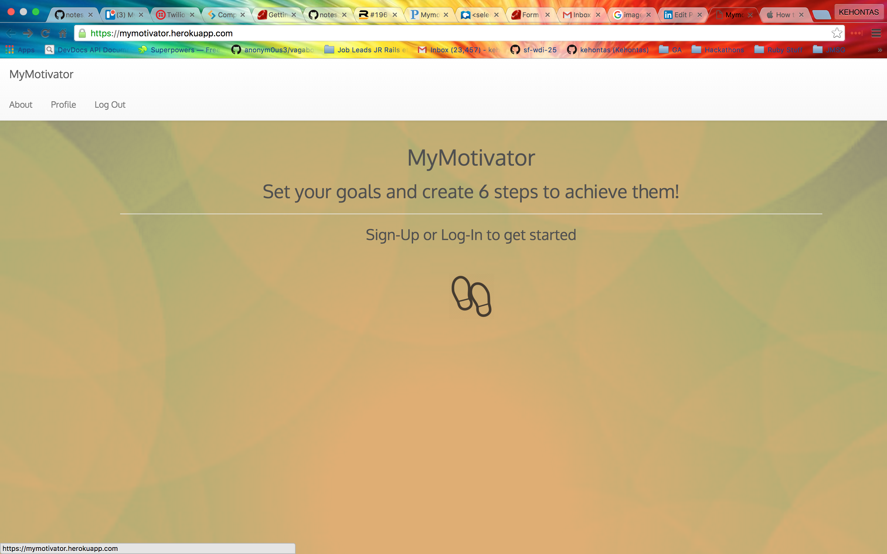
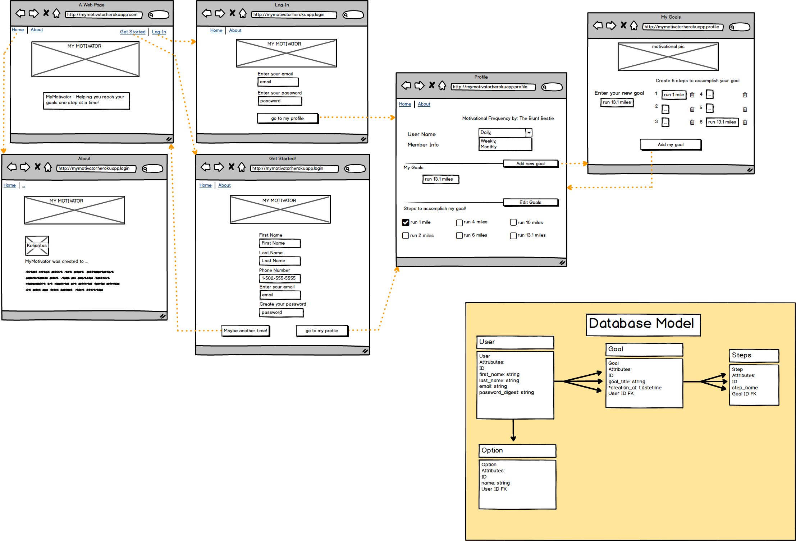

## MyMotivator
MyMotivator is an app designed with the "Minimum of 6" a goal achieving method
developed by Kehontas Rowe.  This app allows the user to create
a goal and 6 steps to complete that goal. The user will receive sms reminders
to complete the steps and can respond to the sms reminders in order to
check off the steps. This allows the user interact with their goal and steps via the
the web app as well as a mobile platform.


## Contents
* **[Screenshot](#screenshot):** What does MyMotivator application look like?
* **[Wireframes](#wireframes):** How did I envision the application's user interface?
* **[Heroku Link](#heroku-hosted-project)**
* **[Technologies](#technologies):** What languages, gems, libraries, and frameworks are being used?
* **[Future Development](#future-development):** What I am hoping to add?
* **[Awesome Code to Show](#Awesome-Code):** Proud Code Moment


## Screenshot


## Wireframes



## Technologies
* Languages
	* Ruby on Rails
	* HTML5
	* CSS3

* Gems/External Libraries
	* bcrypt
	* RSpec
	* Bootstrap

* Database
	*  PostgreSQL

* Trello
	* Project Management

## Future Development
*	Complete basic functionality of site expectations
* 	Use Twilio to allow users to recieve SMS messages based on chosen frequecy
*  Allow user to respond to Web App via SMS
*  Adjust site

## Heroku
<a href="https://mymotivator.herokuapp.com/" target="_blank">MyMotivator</a>

## LinkedIn
 <a href="https://www.linkedin.com/in/kehontas" target="_blank">Kehontas Rowe</a>

## Awesome Code to Show
```
<div class="container text-center">

      <div class="well well-sm">
        <h4>
          <%= form_for @goals, url: {action: "create" } do |f| %>
          <p>
            <%= f.label :name, "What's Your Goal" %><br/>
            <%= f.text_field :name %>
          </p>
        </p>
        <h6>
          <%= f.check_box :_destroy %>
          <%=  f.label :_destroy, "Remove" %>
        </h6>
      </p>
    </div>

    <div class="well well-sm">
      <h4>Create the Six Steps that will move you towards you goal</h4><br>
      <%= f.fields_for :steps do |builder| %>
      <p>
        <%= builder.label :name, "Goal Step" %><br>
        <%= builder.text_field :name %>
      </p>
      <p>
        <h6>
          <%= builder.check_box :_destroy %>
          <%= builder.label :_destroy, "Remove" %>
        </h6>
      </p>

      <% end %>
    </div>
    <p><%= f.submit "Submit" %></p>
    <% end %>
  </div>
```
